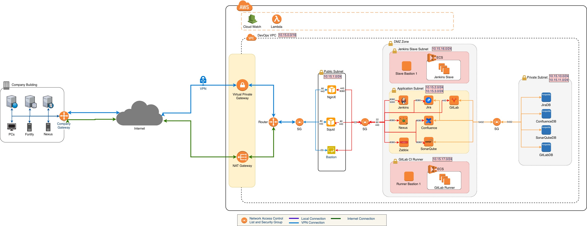

# Infrastructure as Code for DevOps System on AWS

This project buiding on frameworks:
1. Terraform
2. Ansible

## Contents
  [1.   Architecture](#Architecture)
  [1.1. Architecture for Hybrid DevOps System](#Architecture-for-Hybrid-DevOps-System)

## Architecture

### Architecture for Hybrid DevOps System

